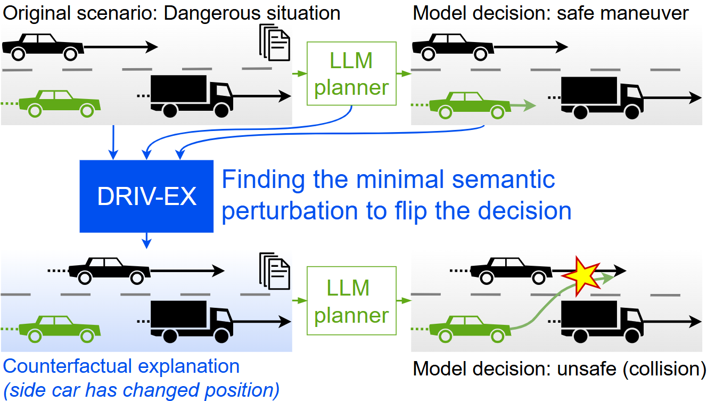
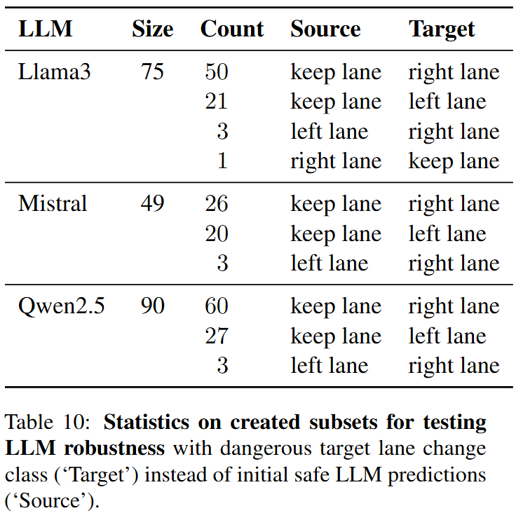

# [ACL Findings 2026] DRIV-EX: Counterfactual Explanations for Driving LLMs

[](https://aclanthology.org/2026.findings-acl.1152.pdf)
[](https://arxiv.org/abs/2603.00696)
[](https://valeoai.github.io/publications/drivex/)

This is the official implementation of the paper "DRIV-EX: Counterfactual Explanations for Driving LLMs" (ACL Findings 2026).

## 👁️ DRIV-EX overview

<p align="center">
  
</p>

DRIV-EX is a model-agnostic framework for explaining the decisions of LLM-based driving planners. It identifies the smallest semantic changes to a scene description that flip the LLM's decision, combining gradient-based optimization with controlled decoding to ensure fluent and realistic counterfactuals. DRIV-EX enables analysis of driving LLMs' behavior, helping uncover learnt biases and improve robustness.
Please refer to the Licenses below.

## 📁 Repository Structure

```text
DRIV_EX/
├── assets/
├── driv_ex/                     # Main code folder
│   ├── cf_algorithms/
│   ├── cf_scoring/
│   ├── dataset/
│   ├── llm_evaluation/
│   ├── llm_finetuning/
│   ├── utils/
│   └── LLM_token.json           # <-- HuggingFace token goes here
├── LCLLM_ckpts/
│   ├── classic_FT/              # <-- Fine-tuned checkpoints of Driving LLMs go here
│   └── X_vision_FT/             # <-- Fine-tuned checkpoints of Fluency experts go here
├── LLM_cache/                   # <-- HuggingFace cache files are saved here
├── results/
│   ├── cf_algo_results/         # <-- Counterfactual scenes and scores are saved here
│   └── llm_evaluation_results/  # <-- Evaluation results of LLMs on driving tasks are saved here
├── scripts/
├── textual_driving_data/
│   ├── highD_by_lcllm/          # <-- Textual driving data from LC-LLM paper goes here
│   └── highD_val_crash_data/    # <-- Our custom safety-critical subsets go here
├── drivex_requirements.txt
├── LICENSE_MODEL_AND_DATA.txt
├── LICENSE.txt
├── MODElS.md
├── pyproject.toml
├── THIRD-PARTY-NOTICES.txt
└── README.md
```

## :hammer_and_wrench: Install

### Disclaimer

The code was exclusively developped and run on NVIDIA 40GB A100 GPUs.

### Environment

```bash
cd DRIV_EX

# Create and activate environment
conda create --name DRIV_EX python=3.10.13
conda activate DRIV_EX

# Install PyTorch with CUDA 11.8 via conda
conda install pytorch==2.2.1 torchvision==0.17.1 torchaudio==2.2.1 pytorch-cuda=11.8 -c pytorch -c nvidia

# Install ninja build tool before flash-attn
conda install ninja -c conda-forge

# Install main requirements
pip install -r ./drivex_requirements.txt

# Install flash-attn
export MAX_JOBS=4
pip install --no-build-isolation flash-attn==2.7.3

# Install the driv_ex package in editable mode
pip install -e .
```

### Driving data

* **Textual highD: Full LC-LLM data, based on levelXData's dataset**

The highD dataset is a large-scale, high-quality, real-world dataset of vehicle trajectories, recorded using drones on German highways, and distributed by levelXData. To use driving scenes under text format to fine-tune and evaluate LLMs, we used the textual transcription of this dataset, as released on the LC-LLM paper's repository, comprising 144,000 training scenes and 24,000 validation scenes. References to the highD dataset and to the LC-LLM paper and repository are given in the ``Acknowledgements`` section below.

To use this data with our code, one should first download the textual transcription of the highD dataset, available at [this link](https://github.com/Pemixing/LCLLM/blob/main/llm_data) into the ``DRIV_EX/textual_driving_data/highD_by_lcllm`` folder. To use our code without bugs, we recommend processing this dataset as described in the section ``Pre-processing textual highD`` below.

* **Textual highD: Safety-critical subsets**

For the purpose of our work, we extracted safety-critical subsets from the LC-LLM textual highD validation split. This data is released in the ``DRIV_EX/textual_driving_data/highD_val_crash_data/full_crash_subset`` folder, with the agreement of levelXData and LC-LLM's authors.

For each driving LLM that we use, we identified scenarios where the LLM had a safe initial prediction while a dangerous alternative prediction was known. This data is released in the ``DRIV_EX/textual_driving_data/highD_val_crash_data/LLM_eval_on_crash_subset`` folder. Details and statistics on these subsets are given in the paper's Table 10 and reproduced below.

<p align="left">
  
</p>

We are releasing this data to the scientific community to foster research advances. Remark that the data license is more restrictive than the code license. Please see the ``License`` section below.

### LLMs via HuggingFace

The currently released code is implemented for fine-tuning and using Meta's **Llama-3-8B-Instruct** (``--LLM Meta-Llama-3-8B-Instruct``), Mistral's **Mistral-7B-Instruct** (``--LLM mistralai/Mistral-7B-Instruct-v0.3``) and Alibaba's **Qwen2.5-7B-Instruct** (``--LLM Qwen/Qwen2.5-7B-Instruct``), via the HuggingFace hub. We also rely on Microsoft's **deberta-xlarge-mnli** as a scorer for deriving our BERT-Score evaluations.

Create and add a json file named ``LLM_token.json``, containing a **valid HuggingFace token** under string format, in the ``./driv_ex`` folder. Ensure you requested the proper rights on HuggingFace (e.g., to use Meta's Llama 3 8B Instruct LLM, etc.).

### Checkpoints

For each LLM model and training data pair, we fine-tuned 2 sets of LoRA weights to enable the use of DRIV-EX:
* a `Driving LLMs`, trained to generate driving actions (`Y` in the code) given the system message (`X_sys` in the code) and driving scene descriptions (`X_vision` in the code),
* a `Fluency expert`, trained to generate driving scene descriptions given the system message.

The base model being similar between the Driving LLM and the Fluency Expert, our DRIV-EX implementation simply activates the proper set of LoRA weights for corresponding algorithm sections.

We release the Driving LLM's and the Fluency Expert's LoRA weights, fine-tuned on the original textual highD data (unbiased), for Llama-3-8B-Instruct, Mistral-7B-Instruct and Qwen2.5-7B-Instruct. These checkpoints were used to derive the paper's main results (Tables 1 and 7 of the paper).

<table style="margin-left: 0; margin-right: auto;">
  <thead>
    <tr>
      <th>LLM name</th>
      <th>Finetuning type</th>
      <th>Download link</th>
    </tr>
  </thead>
  <tbody>
    <tr>
      <td>Llama-3-8B-Instruct</td>
      <td align="left">Driving LLM</td>
      <td><a href="https://github.com/Amaia-CARDIEL/DRIV_EX/releases/download/v1.0.0/Driving_LLM_Llama-3-8B-Instruct.tar.gz">link (to come)</a></td>
    </tr>
    <tr>
      <td></td>
      <td align="left">Fluency Expert</td>
      <td><a href="https://github.com/Amaia-CARDIEL/DRIV_EX/releases/download/v1.0.0/Fluency_expert_Llama-3-8B-Instruct.tar.gz">link (to come)</a></td>
    </tr>
    <tr>
      <td>Mistral-7B-Instruct</td>
      <td align="left">Driving LLM</td>
      <td><a href="https://github.com/Amaia-CARDIEL/DRIV_EX/releases/download/v1.0.0/Driving_LLM_Mistral-7B-Instruct.tar.gz">link (to come)</a></td>
    </tr>
    <tr>
      <td></td>
      <td align="left">Fluency Expert</td>
      <td><a href="https://github.com/Amaia-CARDIEL/DRIV_EX/releases/download/v1.0.0/Fluency_expert_Mistral-7B-Instruct.tar.gz">link (to come)</a></td>
    </tr>
    <tr>
      <td>Qwen2.5-7B-Instruct</td>
      <td align="left">Driving LLM</td>
      <td><a href="https://github.com/Amaia-CARDIEL/DRIV_EX/releases/download/v1.0.0/Driving_LLM_Qwen2.5-7B-Instruct.tar.gz">link (to come)</a></td>
    </tr>
    <tr>
      <td></td>
      <td align="left">Fluency Expert</td>
      <td><a href="https://github.com/Amaia-CARDIEL/DRIV_EX/releases/download/v1.0.0/Fluency_expert_Qwen2.5-7B-Instruct.tar.gz">link (to come)</a></td>
    </tr>
  </tbody>
</table>

Checkpoints are shared in the v1.0.0's release of this repository (one tar file per set of weights). Please refer to [MODELS.md](MODELS.md) for the instructions on how to untar them. Once done, save the obtained checkpoint folder (containing the .pt, .json and .bin files) in subfolders named as follows:
* for Driving LLMs: ``DRIV_EX/LCLLM_ckpts/classic_FT/{checkpoint_folder}``,
* for Fluency Experts: ``DRIV_EX/LCLLM_ckpts/X_vision_FT/{checkpoint_folder}``,

We are releasing these weights to the scientific community to foster research advances. Remark that the model / weights license is more restrictive than the code license. Please see the ``License`` section below.

## :pager: How to use our code & scripts

### Pre-processing textual highD

We used a slightly modified driving template from LC-LLM, a bit shorter and correcting a few typos from the original textual highD. In addition, we augment the dataset with lane change labels attached to each driving scene. We also generate input-only versions of the textual highD datasets to enable the fine-tuning of Fluency experts, on driving scene generation.

To use our code without bug, run the following preprocessing commands (in order).

```bash
# Correct typos and add lane change labels
bash ./scripts/run_preprocessing_dataset.sh

# Extract input-only versions of the textual highD datasets => required for Fluency expert fine-tuning
bash ./scripts/run_input_only_data_generation.sh
```

### Fine-tuning LLMs into `Driving LLMs` and `Fluency experts`

Our fine-tuning code is a reimplementation of the LoRA fine-tuning proposed in LC-LLM (cf references in the ``Acknowledgements`` section). It is performed on the full textual highD training set and produces `Driving LLMs`, able to generate driving actions (lane change and trajectory predictions) given driving scene descriptions. One can use our dedicated fine-tuning script as follows.

```bash
# Fine-tuning Driving LLMs (default to Llama-3-8B-Instruct)
bash ./scripts/run_finetuning_driving_LLMs.sh
```

For each `Driving LLM`, we also train a `Fluency expert`, fine-tuned to generate driving scene descriptions. This Fluency expert is required to perform biased autoregressive re-generation of driving scenes, during the second step of the DRIV-EX algorithm. To train them, one has first to generate input-only versions of the textual highD datasets (cf ``Pre-processing textual highD`` section above), then to run our dedicated fine-tuning script.

```bash
# Fine-tuning LLMs to be a Fluency expert (default to Llama-3-8B-Instruct)
bash ./scripts/run_finetuning_fluency_experts.sh
```

Remarks on the python commands called within both fine-tuning bash scripts:

* To reproduce our Mistral-7B-Instruct fine-tuning, simply uncomment the corresponding section in both scripts (the difference is the ``--LLM mistralai/Mistral-7B-Instruct-v0.3`` LLM flag and the ``--gradient_accumulation_steps 32`` flag).

* To reproduce our Qwen2.5-7B-Instruct fine-tuning, simply uncomment the corresponding section in both scripts (the difference is the ``--LLM Qwen/Qwen2.5-7B-Instruct`` LLM flag and the ``--epochs 4`` flag for the driving LLM part).

* Adding ``--resume`` enables to resume the training from the last checkpoint, instead of fine-tuning from scratch.

* To fine-tune driving LLMs on different templates, simply change the ``--train_files`` and ``--validation_files`` fields to point towards different files.

Note that the resulting checkpoints (LoRA weights) of this fine-tuning will be released in this repository (cf ``Checkpoints`` section above).


### Evaluating the performance of driving LLMs

Evaluation is performed following LC-LLM (cf references in the ``Acknowledgements`` section) on the full textual highD val set (24,000 driving scenes).

Our evaluation script referenced below will first ensure it has access to the augmented version of the val dataset, where we added lane change labels (cf ``Pre-processing textual highD`` section above). It then performs the LC-LLM evaluation, adding an estimate of collisions within 4 seconds. This script led to results, visible in the paper's Tables 4, 7 and 9.

Once an LLM checkpoint has been evaluated on the full val set, the script additionally extracts its evaluation results on the safety-critical subset (809 driving scenes) and save them under ``DRIV_EX/textual_driving_data/highD_val_crash_data/LLM_eval_on_crash_subset``.

```bash
# Evaluating driving LLMs (unbiased Llama-3-8B-Instruct on original textual highD by default)
bash ./scripts/run_eval_driving_LLMs.sh
```

To perform evaluations on Mistral-7B-Instruct or Qwen2.5-7B-Instruct, simply uncomment the corresponding section in the evaluation script.

Note that we release the resulting data in ``DRIV_EX/textual_driving_data/highD_val_crash_data/LLM_eval_on_crash_subset`` so you don't need to run this evaluation if you only care about this data.

### Generating counterfactual explanations

Counterfactual generation is performed on safety-critical scenarios, identified in our work among the textual highD val set. Details on this data are given in the ``Driving data`` section above. By default, the scripts generate counterfactual explanations for unbiased Llama-3-8B-Instruct.

* **Using DRIV-EX**

```bash
# Running DRIV-EX (optimized params by default)
bash ./scripts/run_drivex.sh
```

* **Using concurrent works** (partly re-implemented code)

```bash
# PEZ (Wen et al., Hard Prompts Made Easy: Gradient-Based Discrete Optimization for Prompt Tuning and Discovery, NeurIPS 2023)
bash ./scripts/run_pez.sh
bash ./scripts/run_pez.sh adapt # PEZ † (adapted by us to the task)

# DAB (Pynadath et al., Controlled LLM Decoding via Discrete Auto-regressive Biasing, ICLR 2025)
bash ./scripts/run_dab.sh
bash ./scripts/run_dab.sh adapt # DAB † (adapted by us to the task)

# GCG (Zou et al., Universal and Transferable Adversarial Attacks on Aligned Language Models, arxiv 2023)
bash ./scripts/run_gcg.sh
```

### Deriving counterfactual generation scores

Once counterfactual scenes have been generated, one can derive the scores we report in the paper's Main results, in Table 1, using the following script.

```bash
bash ./scripts/compute_cf_score.sh --results_path <path> [--dab] [--BS_lb <float>]
```

Arguments:
- `--results_path` *(required)*: path to the folder containing the results to analyse.
  - If an **absolute path** is given, it is used as-is.
  - If a **relative path** is given, it is appended to `REPO_DIR/results/cf_algo_results/LC_LLM/`.
  - In both cases, the script reads per-sample JSON files from a `best_results_json/` subfolder.
  - DRIV-EX / PEZ / PEZ† results are saved under `main_results/`; DAB / DAB† under `DAB_results/`; GCG under `gcg_results/`.
- `--dab` *(flag, optional)*: set this flag if the results come from a DAB-based algorithm (DAB, DAB†). Omit it for other algorithms (DRIV-EX, PEZ, PEZ†, GCG).
- `--BS_lb` *(float, optional)*: BertScore lower bound threshold used for success criteria (default: `0.95`).


Scores are printed to the console and also saved as `cf_scores.json` in the given ``results_path`` results folder.

## ⚖️ License

We are releasing the code in this repository under the [MIT License](LICENSE.txt).

We are releasing the models' checkpoints and data subsets under the **research-only** [DRIV-EX Model & Data License](LICENSE_MODEL_AND_DATA.txt). Checkpoints were trained using datasets that are subjected to their own licenses and restrictions.


## 📜 Citation

If you use our code, please consider citing our paper:

```
@inproceedings{cardiel-etal-2026-driv,
    title = "{DRIV}-{EX}: Counterfactual Explanations for Driving {LLM}s",
    author = "Cardiel, Amaia  and
      Zablocki, Eloi  and
      Ramzi, Elias  and
      Gaussier, Eric",
    booktitle = "Findings of the {A}ssociation for {C}omputational {L}inguistics: {ACL} 2026",
    month = jul,
    year = "2026",
    url = "https://aclanthology.org/2026.findings-acl.1152/",
}
```

## 🌟 Acknowledgements

This work was made possible thanks to prior, open source, works, in particular the following ones. If you find their work useful, please consider citing them as well.

(In addition, the full list of third-party code and libraries used is given in the [THIRD-PARTY-NOTICES file](THIRD-PARTY-NOTICES.txt).)

* **leveLXData public datasets**

Development of this project is based on the high-quality, real-world trajectory and scenario data provided by leveLXData. In particular, we thank leveLXData for granting us ‘Access for Non-Commercial Use’ to the [highD dataset](https://ieeexplore.ieee.org/document/8569552).
leveLXData public datasets, such as highD, inD, exiD, and uniD, are available at ["https://levelxdata.com/#publicdatasets"](https://levelxdata.com/#publicdatasets">https://levelxdata.com/#publicdatasets).

<div style="display: flex; align-items: center;">
  <a href="https://levelxdata.com">
    
  </a>
</div>

&nbsp;
* **LC-LLM paper**

Our fine-tuning of driving LLMs was done following the [LC-LLM: Explainable lane-change intention and trajectory predictions with Large Language Models](https://www.sciencedirect.com/science/article/pii/S2772424725000101) paper.
Their open source code and textual version of the highD dataset are available on [this repository](https://github.com/Pemixing/LCLLM/). We are grateful to the authors of the paper for granting us permission to release a subset of their textual highD dataset.

* **PEZ**

Our reimplementation of the PEZ algorithm, from the [Hard Prompts Made Easy: Gradient-Based Discrete
Optimization for Prompt Tuning and Discovery](https://papers.nips.cc/paper_files/paper/2023/file/a00548031e4647b13042c97c922fadf1-Paper-Conference.pdf) paper, relied strongly on its official repository, available [here](https://github.com/YuxinWenRick/hard-prompts-made-easy).


* **DAB**

Our reimplementation of the DAB algorithm, from the [Controlled LLM Decoding via Discrete Auto-regressive Biasing](https://proceedings.iclr.cc/paper_files/paper/2025/file/bce52456a36be2be1abd95427139de37-Paper-Conference.pdf) paper, relied strongly on its official repository, available [here](https://github.com/patrickpynadath1/dab).

* **GCG**

Our reimplementation of the GCG algorithm, from the [Universal and Transferable Adversarial Attacks on Aligned Language Models](https://arxiv.org/abs/2307.15043) paper, relied partly on its official repository, available [here](https://github.com/llm-attacks/llm-attacks).


